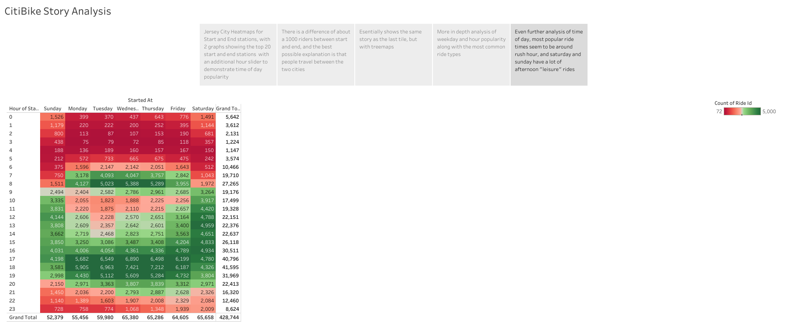
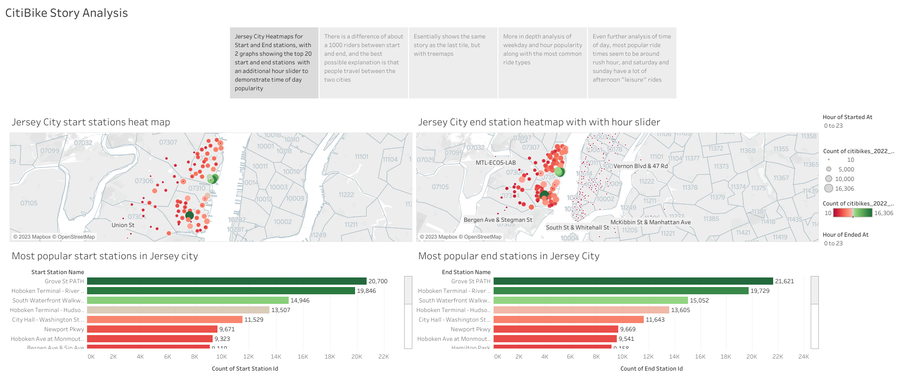
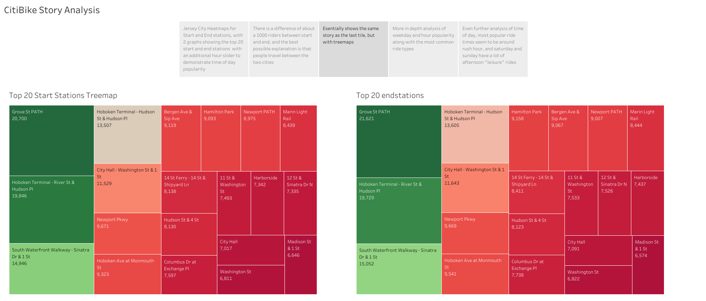
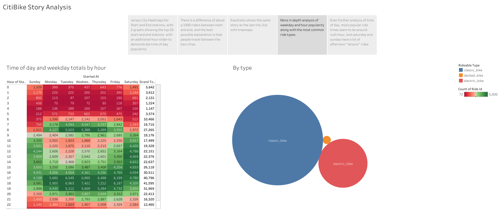
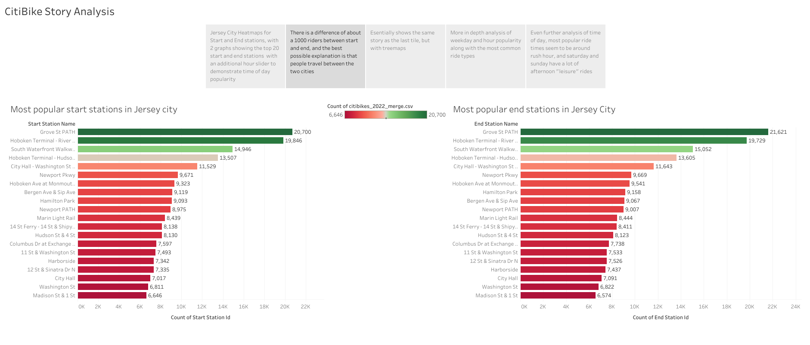
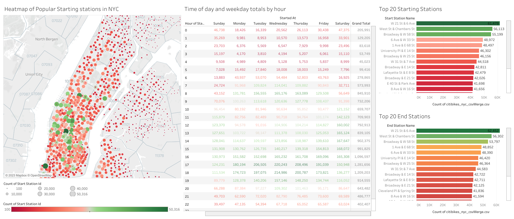

# citi-bike

Tableau Analysis of the Citibike program that is going on in the cities of Jersey City and Nyc. Ended up doing a more in depth analysis of Jersey city as the dataset was smaller and easier to play with. Below will be a few screenshots of the Jersey city story and a quick synopsis dash of the NYC program. Next step would be to combine the two csvs to compare the two locations and  to see how much the programs intermingle within the two urban centers, but that would take too much processing time for now.

